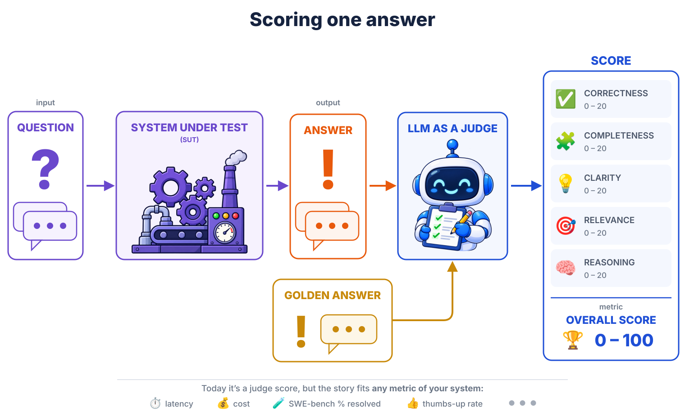

<!--
1.1 LLM-as-a-judge pipeline.
One (question -> system -> answer) graded by an LLM judge vs a golden
answer -> 0-100 score (five 0-20 rubric dimensions). Grey role labels
mark the endpoints: input / output / metric. A quiet bottom banner
generalises: a judge score today, but the story fits any metric of the
system -- latency, cost, SWE-bench % resolved, thumbs-up rate,
and more (three grey dots close the row).
-->
