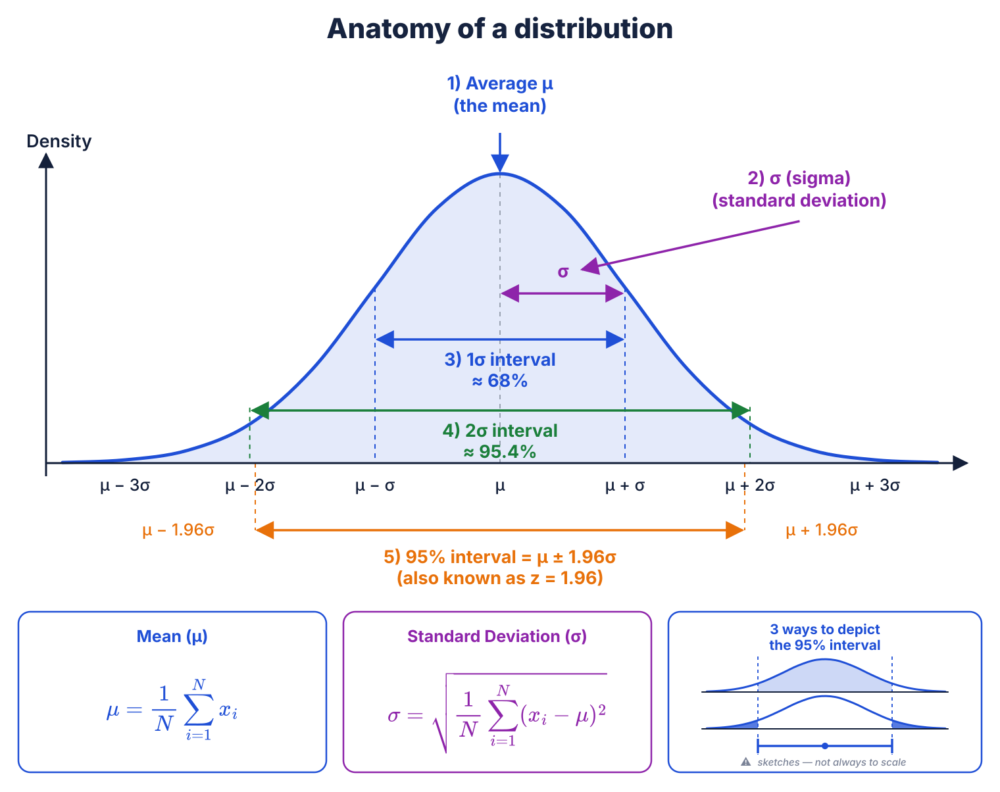

<!--
2.1 Normal distribution: mean, sigma, intervals.
mu (center), sigma (spread); 95% interval mu +/- 1.96 sigma; z ~ 1.96
recurs in the sample-size formula.
Third box: the same 95% drawn three ways - middle shaded, tails shaded,
error bar - so the error bars used from 3.1 onward are earned here.
SAY: "these are the same picture; I'll draw whichever one fits."
NOTE: that box is a schematic, exaggerated so the tails are visible - it
says so on the slide, behind a small warning triangle. Don't quote a
number off it.
The two formula boxes are title + formula only; their caption lines were
cut on purpose, so say what x_i and N are out loud instead.
-->
