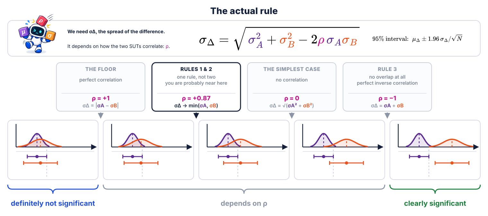

<!--
The answer to the last slide. Four cases, and the three lines between them — and the rival rules
turn out to be the outer two lines, with the real one in the middle.
FIRST collapse the rival rules: "rules 1 and 2 were never two rules. Which mean leaves the
other's interval first isn't a choice — it's decided by which interval is NARROWER. The wide
one's mean always goes first. It cannot be the other way round: if the wide mean were still
inside the narrow interval, both would be inside both, and that is the box on the far left."
THEN walk left to right along the bottom row, reading each line above as you cross it.
THE PUNCHLINE IS BOX 3: neither mean is inside the other's interval, the intervals still
overlap — and it IS significant. Both rival rules get this one wrong, in opposite directions.
WHY the hypotenuse: "the two uncertainties are independent, so they don't add — their squares
do." And a hypotenuse is never shorter than a side nor longer than both, which is exactly why the
rules bracket the answer.
SAY σ, NEVER "standard error" — the term is not in this deck. But do keep the √N audible: σ is
the spread of one answer, σ/√N is the spread of the average. That √N is what section 4 solves
for, so do not let the two blur together.
ON ASYMMETRY, if asked: old-vs-new does not enter the significance question. The asymmetry is
real but it lives in what you DO with the verdict — that is the next slide.
Do NOT say H₀ or alpha — p = 0.05 appears only as the name of the middle line.
NOTE: illustrative numbers — the two margins are the current SUT's and S1's, from the rival-rules
slide; the three lines are exact, and each case Δ is a representative point in its region.
-->
