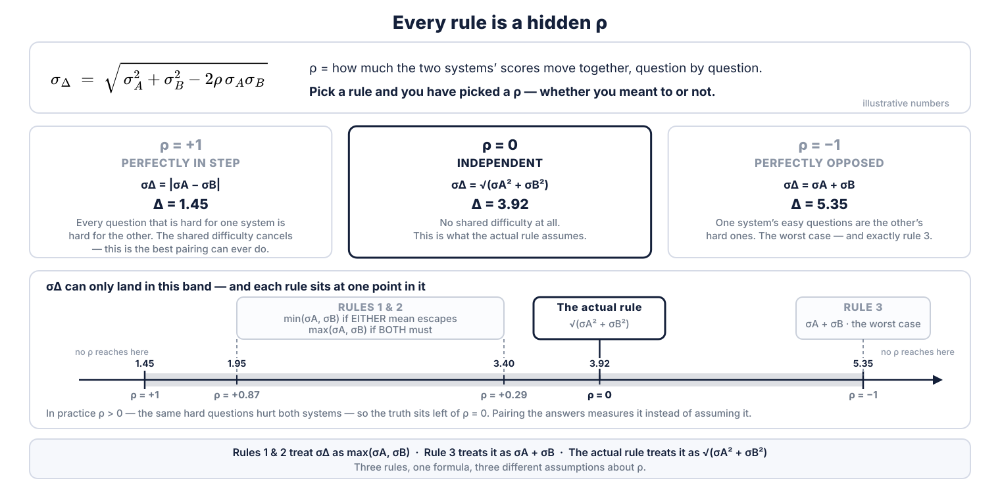

<!--
3.1 — the WHY behind the previous slide. The rival rules bracketed the real edge; this says what
the bracket IS.
OPEN with the formula: "the full expression has a third term. σΔ = √(σA² + σB² − 2ρ·σA·σB). ρ is
just: do the two systems find the same questions hard?"
THEN the punchline: "you cannot avoid picking a ρ. Every rule on the last slide IS a ρ — you just
don't get told which one you chose."
WALK the three cards left to right: ρ = +1, the shared difficulty cancels and Δ = 1.45 is the
floor; ρ = 0, no shared difficulty, Δ = 3.92 — and that is what we ship; ρ = −1, the worst case,
Δ = 5.35 — which is EXACTLY rule 3. Rule 3 is the only rule that can never fire too early, and
that is why it feels safe and why it is far too conservative.
THEN the number line: the rules are not near each other. Rules 1 & 2 sit at ρ = +0.87 or +0.29
depending on which reading of "escapes the interval" you take — two different hidden assumptions
inside one rule.
LAND IT: our rule assumes ρ = 0. That is a CHOICE, not a measurement. And in practice ρ > 0 — the
same hard questions hurt both systems — so the truth sits left of ρ = 0 and we are being
conservative. Pairing the answers measures ρ instead of assuming it.
SAY σ, NEVER "standard error". Every printed number is a threshold on Δ, not a σ.
Do NOT say H₀ or alpha here.
NOTE: illustrative numbers — the two margins are the current SUT's and S1's, carried from the
rival-rules slides; every Δ and every ρ printed is exact for those two margins.
-->
