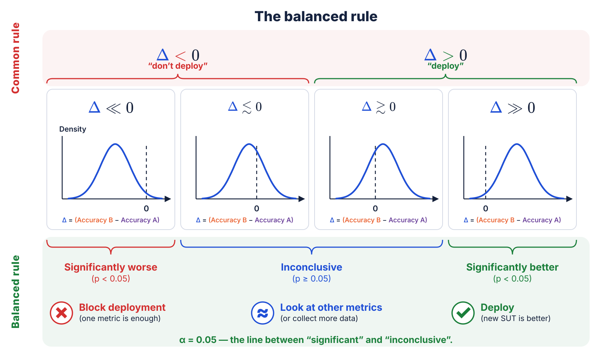

<!--
3.3 Look at one curve — the distribution of the difference Δ. Does its confidence interval exclude 0?
NAME α HERE. The closing line is `α = 0.05 — the line between "significant" and "inconclusive"`, and
this is the deck's first time the threshold gets its Greek name rather than just its number. The
p-values in the verdict row are what it cuts. Everything downstream — the confusion matrix, the N
formula — assumes the room has met α by now.
SAY the action row out loud, because it is what this slide adds: one metric coming back
significantly worse is already enough to BLOCK the deployment — you do not need the others to agree.
And the middle answer is not a dead end: "inconclusive" means look at your other metrics, or go
collect more data. Do NOT read it as "we learned nothing".
PAUSE — take questions; then introduce the confusion-matrix framing (next slide).
-->
